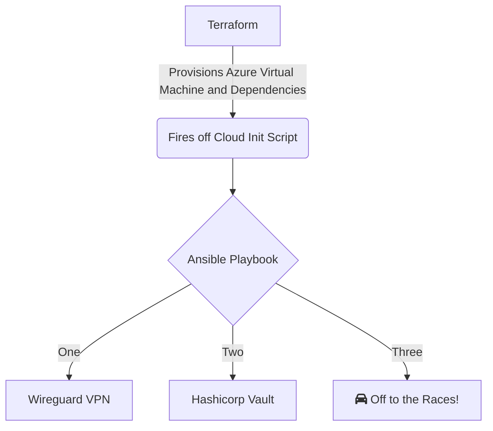

# Hashicorp Vault Provisioning

## High Level Overview



## Interacting With My Vault

This repo configures a VPN server using the Wireguard application to connect my client device to my Azure resources.

```powershell
..\terraform.exe apply
ssh-keygen -t ed25519 -C "Azure-Terraform-Key" -b 4096 -N
ssh-keygen -t ed25519 -C "Azure-Terraform-Key" -b 4096
ssh-keygen -t ed25519 -C "Azure-Terraform-Key" -b 4096
..\terraform.exe apply
ssh-keygen -t rsa -C "Azure-Terraform-Key" -b 4096
rm .\mykey .\mykey.pub .\azurekey.key .\azurekey.pub

rm .\mykey, .\mykey.pub, .\azurekey.key,.\azurekey.pub

ssh-keygen -t rsa -C "Azure-Terraform-Key" -b 4096

..\terraform.exe apply

az account list --query "[?user.name=='mestemax@mail.uc.edu'].{Name:name, ID:id, Default:isDefault}" --output Table

az login

..\terraform.exe apply
```

### Noteworthy Sources I Referenced

- https://sbulav.github.io/terraform/terraform-azurerm-compute-custom-data/
- Production Hardening | Vault | HashiCorp Developer


- Passing Custom Data to Terraform Azure RM Compute Module - Cloud Alchemist (sbulav.github.io)
- What are Terraform Templates? Examples and Use Cases (spacelift.io)
- Using templatefile in Terraform - YouTube
- azurerm_public_ip | Data Sources | hashicorp/azurerm | Terraform | Terraform Registry
- https://hub.packtpub.com/what-is-hcl-hashicorp-configuration-language-how-does-it-relate-to-terraform-and-why-is-it-growing-in-popularity/

- Note Dynamic - Public IP Addresses aren't allocated until they're assigned to a resource (such as a Virtual Machine or a Load Balancer) by design within Azure.


